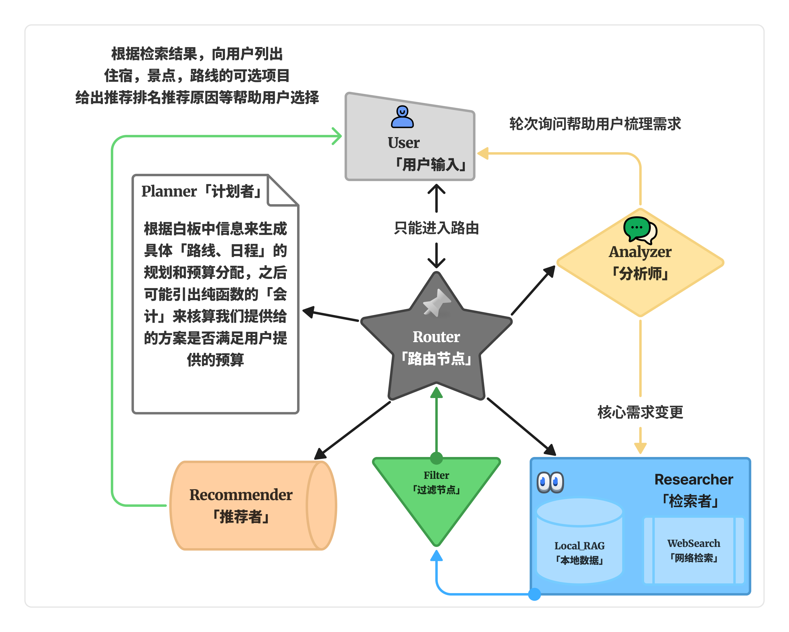
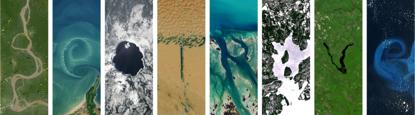

<p align="">
  
</p>


# GeoTrave: High-Performance Multi-Agent Travel Architect

GeoTrave is a sophisticated travel planning engine built on **LangGraph**, utilizing a robust multi-agent orchestration to transform complex natural language into structured, executable travel itineraries.

## Core_Architectural_Features
<p align="center">
  
</p>

### Multi_Agent_Orchestration
- **Gateway_Layer (Router)**: High-fidelity intent classification and security gating to ensure precise task routing.
- **Extraction_Layer (Analyzer)**: Structural entity extraction and persistent profile construction from conversational history.
- **Augmentation_Layer (Researcher)**: Parallel execution of multi-source data acquisition, integrating local Vector DB (RAG), web search, and weather APIs.

### High_Performance_Engine
- **Async_First_Design**: Fully non-blocking execution utilizing Python `asyncio`. Internal blocking I/O (ChromaDB/DDGS) is offloaded to managed thread pools via `asyncio.to_thread`.
- **Intelligent_RAG_Filtering**: Large-scale retrieval results are processed through a chunked, parallel filtering system (15 items per batch) to minimize latency while maximizing context relevance.
- **Singleton_LLM_Factory**: Centralized model management providing optimized instance reuse and standardized configuration.


## Getting_Started

### Prerequisites
- Python `3.12+`
- [uv](https://astral.sh/uv) (Package Management)

### Environment_Configuration
Create a `.env` file based on the project requirements:
```python
# LLM Configurations
ANALYZER_MODEL="gemini-1.5-pro"
RESEARCHER_MODEL="gemini-1.5-flash"
EMBEDDING_MODEL="text-embedding-004"

# API Keys
GOOGLE_API_KEY="your_api_key"
TAVILY_API_KEY="your_api_key"
```

### Installation_and_Execution
```bash
# Clone repository
git clone https://github.com/linnene/geotrave.git
cd geotrave

# Sync dependencies
uv sync

# Launch Backend API
$env:PYTHONPATH="."
uv run python src/main.py

# Or use .ps1 to setup quickly
./scripts/set.ps1

# Launch Diagnostic UI
uv run streamlit run test/test_ui.py
```

## Evaluation_and_Quality_Assurance
GeoTrave utilizes a data-driven testing framework built on `pytest` and `pytest-asyncio` for comprehensive workflow validation.

| Dimension | Metric | Tool |
| :--- | :--- | :--- |
| **Logic** | State Transition Integrity | [test/eval/test_agent_workflow.py](test/eval/test_agent_workflow.py) |
| **Performance** | Async Throughput | [script/run_eval.ps1](script/run_eval.ps1) |
| **RAG** | Retrieval Precision | [docs/EVAL.md](docs/EVAL.md) |

## Repository_Structure
```bash
src/
├── agent/       # StateGraph logic and Node definitions
├── database/    # ChromaDB (Vector DB) and RAG logic
├── api/         # FastAPI endpoints and schemas
└── utils/       # LLM Factory, Config, and Logger
```

---


<p align="">
  
</p>
