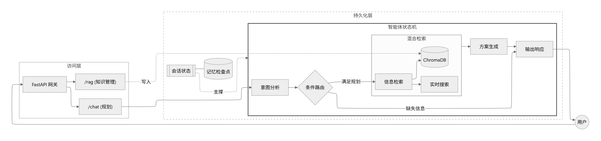
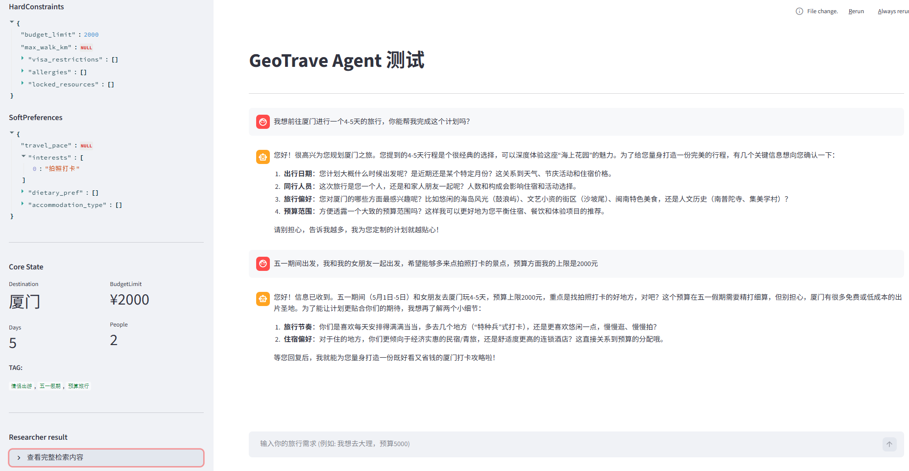

<p align="center">
  
</p>

###  基于 LangGragh 的多智能体协作旅行规划师「GeoTrave」

## CORE  
- **对话引擎**：基于 **LangGraph** 构建的多Agent协作机，以期实现较为复杂的自然语言需求分析与任务拆解。
- **RAG**：使用 **ChromaDB** 本地向量数据库支持RAG，提供行业知识检索与实时的旅行方案生成。
- **大模型支持**：LangGragh支持的主流模型，任务分配包括分析、搜索规划与 Embedding 编码。
- **高性能后端**：使用 **FastAPI** 作为后端框架来构建对话接口，保障高并发场景下的会话隔离与响应速度。


## Getting Started

### 环境准备

项目使用 `uv` 管理

- Python `3.12+`
- [uv](https://astral.sh/uv)（请按照官方安装指南进行安装）

### 环境变量配置

在项目根目录下根据 `.env.example` 模板文件创建一个 `.env` 文件并填写相关字段。
为了AGENT的正常运转，请将这几个Agent Node的LLM完成
  - `ANALYZER_MODEL`: 需求提取。
  - `RESEARCHER_MODEL`: 规划搜索词与资料整理。
  - `FILTER_MODEL`: (可选) 检索结果审计与过滤。

### 启动服务

```bash
git clone https://github.com/linnene/geotrave.git

cd geotrave

uv sync

# 默认启动
uv run python src/main.py

# debug热更新 + 调试日志）
uv run python src/main.py --reload --debug
```
### StreamLit 测试页面

```bash
uv run streamlit run test/test_ui.py
```

###  测试架构
*   **测试框架**：基于 `pytest` + `pytest-asyncio` 实现对 LangGraph 异步工作流的非阻塞断言。
*   **评测维度**：验证 `TravelState` 字段提取准确度、多轮对话记忆累积及 Session 隔离性 (Dimension 2)。
*   **本地运行**：
    ```powershell
    # Windows (PowerShell)
    ./script/run_eval.ps1
    # Linux/macOS (Bash)
    ./script/run_eval.sh
    ```


#### GitHub CI 部署与密钥配置
若要在你的 GitHub 仓库中启用 CI，请在仓库的 **Settings > Secrets and variables > Actions** 中添加以下 **Repository Secrets**：

| Secret 名称 | 描述 |
| :--- | :--- |
| `ANALYZER_MODEL_API_KEY` | Analyzer 节点使用的 API Key |
| `RESEARCHER_MODEL_API_KEY` | Researcher 节点使用的 API Key |
| `TAVILY_API_KEY` | Tavily 搜索服务 API Key (用于 Research 节点) |
| `GOOGLE_API_KEY` | Google AI API Key (用于 Embedding 向量模型) |
| `ANALYZER_MODEL_BASE_URL` | (可选) 自定义模型 Base URL |
| `ANALYZER_MODEL_ID` | (可选) 自定义模型 ID (如 gemini-1.5-flash) |

